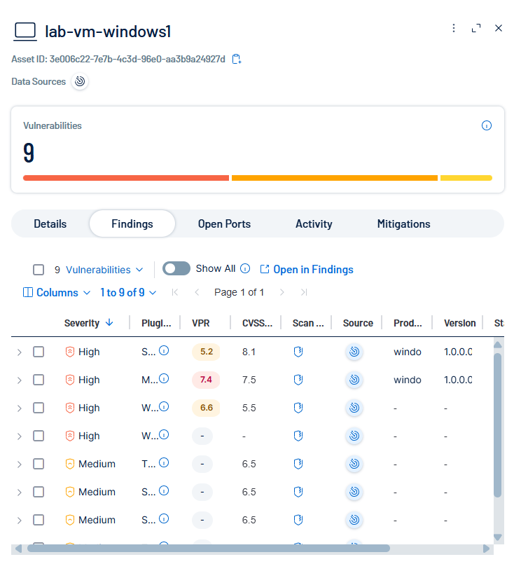

# STIG – Outlook Security Update (April 2024) (Plugin ID: 193266)

## Before
- **Finding:** Microsoft Outlook is missing the April 2024 security update.  
- **Risk:** Spoofing vulnerability – attackers can send specially crafted emails that leak Net-NTLMv2 hashes, enabling relay attacks.  
- **Evidence:**  

  
  

---

## Remediation
- Apply the missing Outlook April 2024 security update.  
- **Steps:**  
  1. Run **Windows Update** and install pending security patches.  
  2. Alternatively, download and install the update manually from Microsoft Update Catalog.  
- **Verification:** Confirm Outlook version is at or above **1.2023.0322.0100**.  

---

## After Remediation
- Expected outcome: Outlook updated and secured against spoofing vulnerability.  
- Evidence (placeholders):  

After – Outlook Details Placeholder  
After – Tenable Rescan Placeholder  

